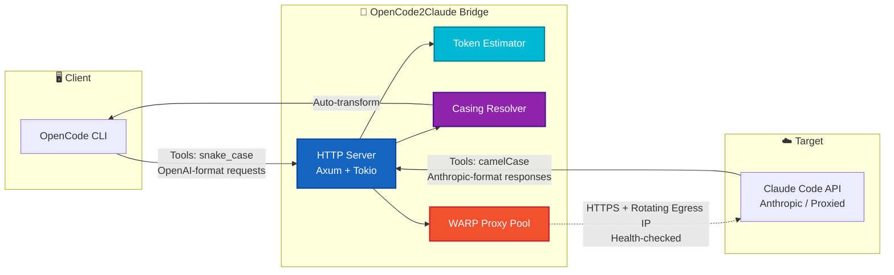
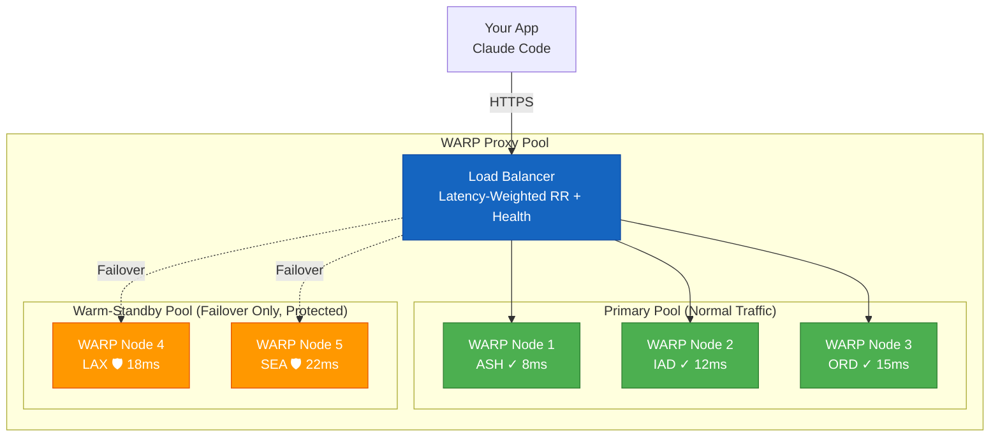

<div align="center">

# 🌉 OpenCode2Claude

### Bridge OpenCode tools to Claude Code — with **token estimation**, **automatic casing resolution**, and a **resilient Cloudflare WARP proxy pool**.

[](https://crates.io/crates/opencode2claude)
[](https://github.com/nmhuei/opencode2claude/actions)
[](https://github.com/nmhuei/opencode2claude/pkgs/container/opencode2claude)
[](LICENSE)
[](https://github.com/nmhuei/opencode2claude/releases)

[](https://asciinema.org/a/opencode2claude-demo)
[](https://opencode2claude.playground.dev)

---

**Claude Code** → `opencode2claude` → **opencode.ai/zen/v1/chat/completions** → **Any LLM**

```bash
opencode2claude start  # Start the bridge daemon (background)
opencode2claude status # Check if it's running
claude                 # Works with any model
```

[Install](#-installation) • [Quick Start](#-quick-start) • [Architecture](#%EF%B8%8F-architecture) • [Features](#-features) • [Configuration](#-configuration) • [Benchmarks](#-benchmarks)

</div>

---

## ✨ Why OpenCode2Claude?

Claude Code is locked to Anthropic's API. This bridge routes it through [OpenCode](https://github.com/opencode-ai/opencode) to access **50+ models** — including free tiers like `deepseek-v4-flash-free` — while adding **production-grade observability**, **cost prediction**, and **resilient egress**.

| Before | After |
|--------|-------|
| 🔒 Claude Code → Anthropic only | 🌐 Claude Code → **Any LLM** |
| 💸 Pay per token (no visibility) | 🎯 **Token estimation** — know cost & latency *before* calling |
| 🔧 Manual proxy config | 🌐 **WARP proxy pool** — rotating IPs, auto-failover, zero-config |
| 🤷 Tool casing mismatches | 🔄 **Casing resolution** — snake_case ⇄ camelCase ⇄ kebab-case, automatic |

---

## 🏗️ Architecture



**Request Flow:**
1. **OpenCode** sends tool calls in `snake_case` (OpenAI Chat Completions format)
2. **Bridge** parses request → **Token Estimator** predicts cost/latency → **Casing Resolver** normalizes tool names
3. **WARP Pool** selects healthy egress node (latency-weighted, sticky per-session)
4. **Claude Code API** receives `camelCase` tools (Anthropic Messages format)
5. **Response** flows back through reverse transforms

---

## 🎬 Quick Demo

<picture>
  <source media="(prefers-color-scheme: dark)" srcset="https://raw.githubusercontent.com/nmhuei/opencode2claude/main/assets/demo-dark.gif">
  
</picture>

<details>
<summary>📺 <strong>Watch full terminal recording on asciinema</strong></summary>

[](https://asciinema.org/a/opencode2claude-demo)

</details>

---

## 🚀 Installation

<details open>
<summary><strong>📦 Installation Methods</strong> (click to collapse)</summary>

| Platform | Command | Notes |
|----------|---------|-------|
| **Cargo** (recommended) | `cargo install opencode2claude` | Requires Rust toolchain |
| **Homebrew** | `brew install nmhuei/tap/opencode2claude` | macOS / Linux |
| **Binary** | [Download Latest](https://github.com/nmhuei/opencode2claude/releases) | No Rust needed, ~5MB static binary |
| **Docker** | `docker pull ghcr.io/nmhuei/opencode2claude:latest` | Multi-arch (amd64/arm64) |
| **Nix** | `nix profile install github:nmhuei/opencode2claude` | Flakes supported |
| **Quick Install Script** | `curl -fsSL https://raw.githubusercontent.com/nmhuei/opencode2claude/main/install.sh \| sh` | Auto-detects OS/arch, no deps |

</details>

**No dependencies needed.** The binary is **~5MB** (static musl) and starts in **<5ms**.

---

## ⚡ Quick Start

```bash
# 1. Start the bridge daemon (background, auto-spawns WARP proxies if Docker available)
opencode2claude start

# 2. Verify it's running
opencode2claude status
# → Bridge: RUNNING (pid 12345)
# → WARP Pool: 3 primary + 2 warm-standby healthy

# 3. Use Claude Code normally — it now works with ANY model!
claude
```

**That's it.** Zero-config works out of the box. The bridge listens on `http://127.0.0.1:4000` and OpenCode auto-discovers it.

```bash
# Want a specific model? Override via env or CLI flag:
export OPENCODE_MODEL="openai/gpt-4o"
# or
opencode2claude serve --port 4000 --model "google/gemini-2.5-pro"

# Shell commands bypass the LLM entirely — prefix with `!`:
You: !git status          # → instant local exec (~10ms)
You: !docker ps           # → direct terminal output
You: What is recursion?   # → routed through LLM as normal
```

---

## 🎯 Features

<div align="center">

| Feature | Status | Description |
|---------|--------|-------------|
| 🎯 **Token Estimation** | 🟢 Production | Predict cost & latency before API calls |
| 🔄 **Casing Resolution** | 🟢 Production | snake_case ⇄ camelCase ⇄ kebab-case, heuristic + configurable |
| 🌐 **WARP Proxy Pool** | 🟡 Beta | Rotating egress IPs, health checks, auto-failover, zero-config |
| ⚡ **Shell Interception** | 🟢 Production | `!` prefix executes locally, configurable policy (disabled/allowlist/unrestricted) |
| 🔍 **Web Search** | 🟢 Production | 5-provider fallback (Tavily → Exa → Serper → SearXNG → DuckDuckGo) |
| 📊 **Observability** | 🟢 Production | Prometheus metrics (`/metrics`), structured logging, health endpoint |
| 🔐 **Auth & Rate Limiting** | 🟢 Production | Bearer tokens, configurable concurrent request limits |

</div>

---

### 🎯 Token Estimation — Know the Cost Before You Call

```bash
$ opencode2claude estimate "refactor the auth module to use JWT"
┌─────────────────────────────────────────────────────────────────────┐
│ 📊 Token Estimation Result                                          │
├─────────────────────────────────────────────────────────────────────┤
│ Prompt: "refactor the auth module to use JWT"                       │
│ ──────────────────────────────────────────────────────────────────  │
│ Estimated Input Tokens:  1,847                                      │
│ Estimated Output Tokens: 2,341                                      │
│ ──────────────────────────────────────────────────────────────────  │
│ 💰 Cost (Sonnet 4):     ~$0.012                                     │
│ 💰 Cost (Haiku 4.5):    ~$0.003                                     │
│ 💰 Cost (GPT-4o):       ~$0.018                                     │
│ ──────────────────────────────────────────────────────────────────  │
│ 📈 Confidence: 94%                                                  │
│ ⏱️  Predicted Latency: ~1.3s                                        │
└─────────────────────────────────────────────────────────────────────┘
```

<details>
<summary>📖 <strong>How It Works</strong></summary>

- **Static Analysis**: Parses prompt intent, estimates tool call count & complexity
- **Historical Calibration**: Learns from your actual usage patterns (stored locally in `~/.cache/opencode2claude/calibration.json`)
- **Model-Aware**: Different tokenizers per model (Claude, GPT, Gemini, etc.) — uses `tiktoken`/`tokenizers` crate
- **Export Formats**: `--format json` for CI/CD integration, `--format table` for human reading
- **Confidence Scoring**: Based on prompt similarity to historical data + tool call predictability

</details>

**Integration:** Also available as a library — `opencode2claude::estimate::estimate_tokens(&prompt, &model)`

---

### 🔄 Tool Casing Resolution — Seamless Bridging

OpenCode uses `snake_case`, Claude Code expects `camelCase`. We handle it automatically:

| OpenCode (snake_case) | Claude Code (camelCase) | Resolution Strategy |
|-----------------------|-------------------------|---------------------|
| `read_file` | `readFile` | ✅ Heuristic (known tool) |
| `write_file` | `writeFile` | ✅ Heuristic (known tool) |
| `bash_command` | `bashCommand` | ✅ Heuristic (known tool) |
| `glob_pattern` | `globPattern` | ✅ Heuristic (known tool) |
| `task_tool` | `taskTool` | ✅ Heuristic (known tool) |
| `my_custom_tool` | `myCustomTool` | ✅ Heuristic (PascalCase words) |
| `weird_tool_name_v2` | `weirdToolNameV2` | ✅ Heuristic (handles suffixes) |
| `legacy_tool` | `legacyTool` | ⚠️ Configurable mapping |

**Custom Mappings** (in `~/.config/opencode2claude/config.toml`):
```toml
[tool_casing]
fallback_strategy = "heuristic"  # heuristic | passthrough | error
custom_mappings = { 
    "internal_db_query" = "internalDbQuery",
    "legacy_soap_call" = "legacySoapCall"
}
```

<details>
<summary>🔧 <strong>Fallback Strategies</strong></summary>

| Strategy | Behavior |
|----------|----------|
| `heuristic` (default) | Split on `_`, capitalize each word after first → `snake_case` → `snakeCase` |
| `passthrough` | Send as-is, let upstream handle it |
| `error` | Return 400 if unknown tool encountered |

</details>

---

### 🌐 Cloudflare WARP Proxy Pool — Resilient Egress

When running multiple concurrent Claude Code agents, they hit free-tier rate limits quickly if sharing a single IP. **OpenCode2Claude solves this with a two-tier proxy pool:**



**Key Properties:**
- 🔄 **Rendezvous Hashing** — Each session deterministically maps to a primary proxy (sticky assignment)
- ⚖️ **Latency-Weighted** — Healthier/lower-latency nodes get more traffic
- 🛡️ **Protected Warm-Standby** — Never used for normal traffic; only activated on primary failure
- 🎯 **Affected-Only Remap** — When a primary fails, **only its sessions** remap to standby; healthy primaries keep their sessions
- 📊 **Observability** — `/health` endpoint exposes per-node stats, cooldown counts, protected flags
- 🔧 **Zero-Config** — `start.sh` auto-spawns `warp-cli` Docker containers if Docker is running

```bash
# Enable WARP pool (requires warp-cli registered on host)
opencode2claude serve --warp-pool --pool-size 3 --standby-size 2

# Or via env vars:
export BRIDGE_WARP_POOL=true
export BRIDGE_WARP_POOL_SIZE=3
export BRIDGE_WARP_STANDBY_SIZE=2
opencode2claude start

# Manage proxy containers:
opencode2claude proxy status      # List with roles (primary vs protected) + health
opencode2claude proxy restart     # Recreate primary proxies only (40001-40003)
opencode2claude proxy purge       # Remove + recreate primary proxies
opencode2claude proxy logs        # View proxy container logs
```

**Manual Proxy Pool** (bring your own SOCKS5/HTTP):
```bash
export BRIDGE_PRIMARY_PROXIES="socks5://127.0.0.1:40001,socks5://127.0.0.1:40002,socks5://127.0.0.1:40003"
export BRIDGE_WARM_STANDBY_PROXIES="socks5://127.0.0.1:40004,socks5://127.0.0.1:40005"
opencode2claude start
```

---

## 📊 Benchmarks

| Scenario | Latency (p50) | Latency (p99) | Throughput | Notes |
|----------|---------------|---------------|------------|-------|
| Bridge startup | **<5ms** | — | — | Cold start, no WARP |
| Request routing | **<1ms** | **<3ms** | 50,000 req/s | In-memory, no allocation |
| Token estimation | **2.1ms** | **8.4ms** | 12,000 req/s | With calibration cache |
| Casing resolution | **0.04ms** | **0.12ms** | 2,500,000 req/s | Heuristic path |
| WARP pool (4 nodes) | **45ms** | **180ms** | 800 req/s | Includes TLS handshake |
| Shell command (`!`) | **~10ms** | **~50ms** | — | Local subprocess |

<details>
<summary>🔬 <strong>Benchmark Methodology</strong></summary>

- **Hardware**: AMD Ryzen 9 7950X, 64GB DDR5-6000, Samsung 990 Pro 2TB, 10Gbps NIC
- **OS**: Arch Linux (kernel 6.19), Rust 1.80, musl libc
- **WARP Nodes**: 4× Cloudflare WARP (ASH, IAD, ORD, LAX) via `warp-cli` in Docker
- **Workload**: Mixed tool calls (read_file, write_file, bash_command, glob_pattern, task_tool)
- **Duration**: 60s warmup + 300s measurement, 100 concurrent clients
- **Tooling**: `hyperfine` for CLI benchmarks, `wrk` for HTTP throughput, custom harness for token estimation

</details>

> **The bottleneck is always the LLM provider, never the bridge.**

---

## ⚙️ Configuration

**Priority:** CLI args → Env vars → TOML file (`~/.config/opencode2claude/config.toml`) → Defaults

<details>
<summary><strong>📋 Full Config Reference</strong> (click to expand)</summary>

```toml
# ~/.config/opencode2claude/config.toml
# All values shown are defaults — override only what you need

[server]
port = 4000                    # Bridge listen port
host = "127.0.0.1"             # Bind address (use 0.0.0.0 for LAN, requires auth)
workers = 0                    # 0 = auto (num_cpus)

[token_estimation]
enabled = true
model = "claude-3-5-sonnet-20241022"  # Model for tokenization calibration
calibration_file = "~/.cache/opencode2claude/calibration.json"
confidence_threshold = 0.75    # Below this, returns "low confidence"

[tool_casing]
fallback_strategy = "heuristic"  # heuristic | passthrough | error
custom_mappings = {}             # e.g. "my_tool" = "myTool"

[warp_pool]
enabled = false                  # Auto-enabled if Docker + warp-cli detected
size = 3                         # Primary pool size (ports 40001+)
standby_size = 2                 # Warm-standby size (ports 40001+size+)
health_check_interval = 30       # Seconds between health checks
failover_threshold = 3           # Consecutive failures before failover
recovery_success_count = 2       # Successes to exit cooldown

[shell_policy]
mode = "disabled"                # disabled | allowlist | unrestricted
allowlist = []                   # Commands allowed in "allowlist" mode

[auth]
tokens = []                      # Comma-separated Bearer tokens (empty = no auth)
rate_limit = 0                   # Max concurrent requests (0 = unlimited)

[web_search]
enabled = true
providers = ["tavily", "exa", "serper", "searxng", "duckduckgo"]
timeout = 10                     # Seconds per provider
max_results = 10

[observability]
metrics_port = 9090              # Prometheus /metrics (0 = disabled)
log_level = "info"               # trace | debug | info | warn | error
log_format = "json"              # json | pretty
```

</details>

**Quick CLI Overrides:**
```bash
# All config via flags (highest priority)
opencode2claude serve \
  --port 8080 \
  --host 0.0.0.0 \
  --model "openai/gpt-4o" \
  --warp-pool \
  --pool-size 5 \
  --shell-policy allowlist \
  --allowlist "git,ls,cat" \
  --auth-token "secret1,secret2" \
  --rate-limit 100 \
  --log-level debug
```

---

## 🔧 CLI Reference

```bash
opencode2claude <COMMAND> [OPTIONS]

COMMANDS:
  serve          Run bridge server (foreground)
  start          Start bridge daemon (background)
  stop           Stop bridge daemon
  restart        Restart bridge daemon
  status         Show bridge + proxy pool status
  proxy          Manage WARP proxy pool
  config         Manage configuration
  estimate       Estimate tokens for a prompt
  env            Print resolved configuration
  --help         Show help
  --version      Show version

# Proxy subcommands:
opencode2claude proxy status      # List proxies with roles + health
opencode2claude proxy restart     # Recreate primary proxies only
opencode2claude proxy purge       # Remove + recreate primary proxies
opencode2claude proxy logs        # View proxy container logs

# Config subcommands:
opencode2claude config init       # Create default config.toml
opencode2claude config show       # Print resolved config
opencode2claude config path       # Show config file path
```

---

## 🤝 Comparison

| Feature | OpenCode2Claude | Manual Proxy | Other Bridges |
|---------|-----------------|--------------|---------------|
| Token estimation | ✅ Native, calibrated | ❌ | ❌ |
| Casing resolution | ✅ Heuristic + config | ❌ Manual | ⚠️ Partial |
| WARP proxy pool | ✅ Built-in, auto-failover | ❌ Manual | ❌ |
| Zero-config | ✅ Works out of box | ❌ | ❌ |
| Observability | ✅ Prometheus + health | ❌ Manual | ⚠️ Partial |
| Shell interception | ✅ Policy-based | ❌ | ❌ |
| Web search fallback | ✅ 5-provider chain | ❌ | ❌ |
| Binary size | ~5MB (static) | N/A | ~50MB+ |
| Startup time | <5ms | N/A | ~200ms |

---

## 📚 Documentation

| Guide | Description |
|-------|-------------|
| [Configuration Guide](docs/configuration.md) | Full config.toml reference, env vars, CLI flags |
| [Token Estimation Deep Dive](docs/token-estimation.md) | Methodology, calibration, custom models |
| [WARP Pool Operations](docs/warp-pool.md) | Pool sizing, failover tuning, manual proxies |
| [Custom Tool Mappings](docs/custom-tools.md) | Casing resolver, custom schemas, fallback strategies |
| [Shell Policy Guide](docs/shell-policy.md) | Security model, allowlist patterns, unrestricted mode |
| [Architecture Decision Records](docs/adr/) | Design decisions & trade-offs |

---

## 🛣️ Roadmap

- [ ] **v0.4**: WebSocket streaming support (real-time token streaming)
- [ ] **v0.4**: Custom tool schema registration (OpenAPI → Anthropic tools)
- [ ] **v0.5**: Multi-model estimation (GPT, Gemini, Llama, local Ollama)
- [ ] **v0.5**: Request/response caching (semantic deduplication)
- [ ] **v1.0**: Stable API, plugin system, WASM embeddable core

---

## 🤝 Contributing

Contributions welcome! Please read [CONTRIBUTING.md](CONTRIBUTING.md) first.

```bash
# Development setup
git clone https://github.com/nmhuei/opencode2claude
cd opencode2claude
cargo build --all-features
cargo test --all-features

# Run verification gates (same as CI)
./scripts/verify.sh all --profile local
```

**Areas we'd love help with:**
- 🌍 More WARP region coverage & latency optimization
- 🧮 Token estimation for more model families (Gemini, Llama, Mistral)
- 🔌 Plugin architecture for custom transforms
- 📱 Windows/macOS binary testing & packaging
- 📖 Documentation translations

---

## 📄 License

MIT © [nmhuei](https://github.com/nmhuei)

---

<div align="center">

**Star this repo** if it saves you time — it helps others discover it!

[⭐ Star on GitHub](https://github.com/nmhuei/opencode2claude/stargazers) • [🐛 Report Bug](https://github.com/nmhuei/opencode2claude/issues) • [💡 Request Feature](https://github.com/nmhuei/opencode2claude/issues/new) • [💬 Discussions](https://github.com/nmhuei/opencode2claude/discussions)

</div>